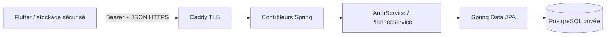
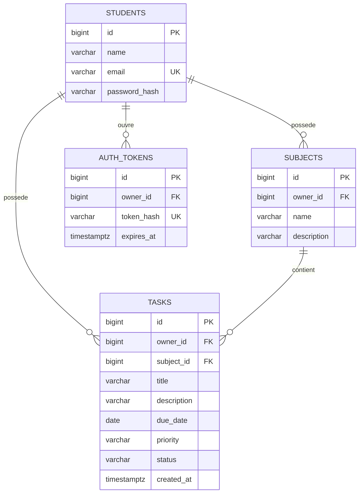

# Architecture et schéma relationnel

Le SQL réel est `backend/src/main/resources/db/migration/V1__initial.sql`. Flyway l'applique une fois et Hibernate valide la correspondance ; pas de modification automatique du schéma en production. Les migrations futures sont ajoutées sous V2, V3… sans modifier V1 déjà déployée.

La propriété d'une tâche et de sa matière est vérifiée dans le service à chaque création/modification. Les lectures et mutations recherchent simultanément id et owner_id. Même si l'application affiche seulement les éléments de l'étudiant, le serveur reste responsable de l'isolation. Les FK empêchent la suppression d'une matière encore utilisée, y compris en cas de concurrence.

Les DTO définissent le contrat client ; les entités JPA ne sont jamais sérialisées. Le jeton aléatoire de 256 bits évite une clé de signature JWT et permet une révocation immédiate. Les sessions expirées sont refusées ; une purge périodique des jetons expirés pourra être ajoutée pour une utilisation longue durée. Le périmètre L3 ne comprend pas récupération de mot de passe, pagination, notifications ou synchronisation hors ligne.
